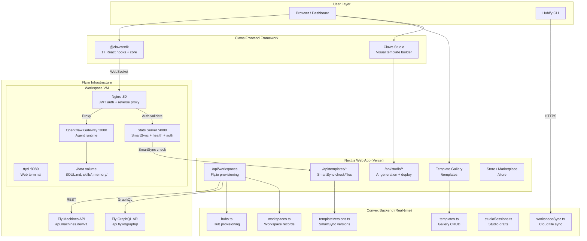
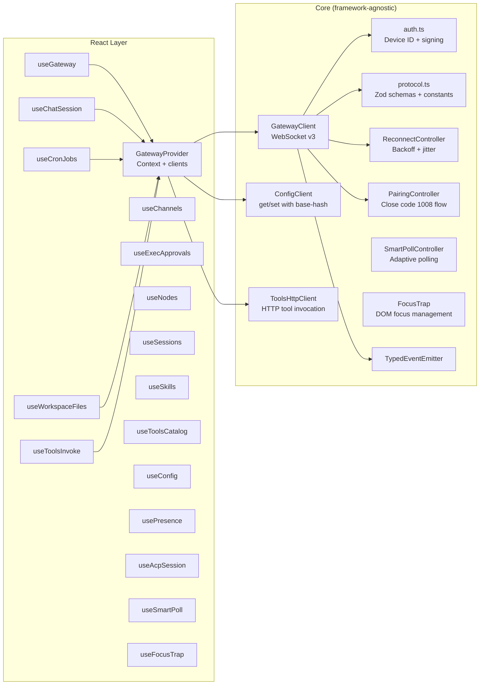
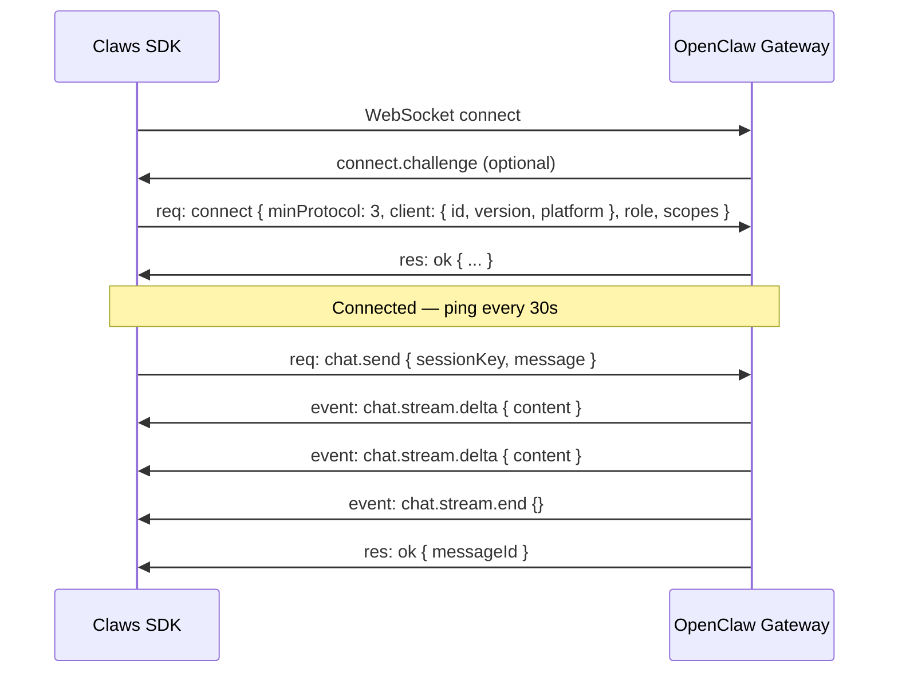
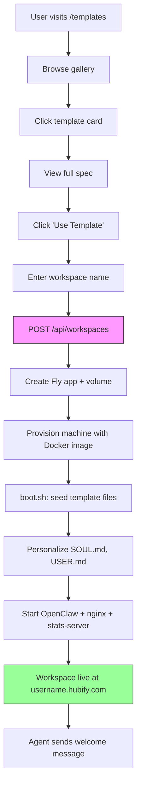
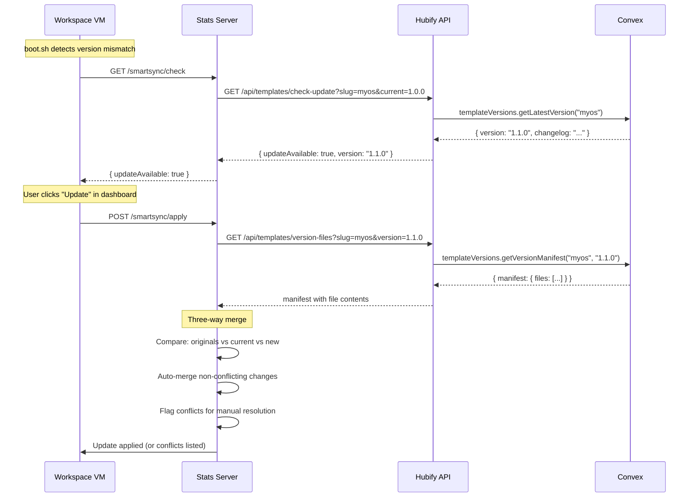
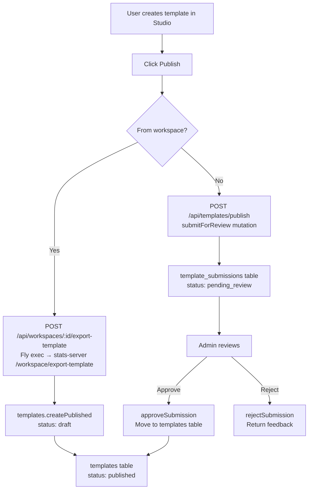
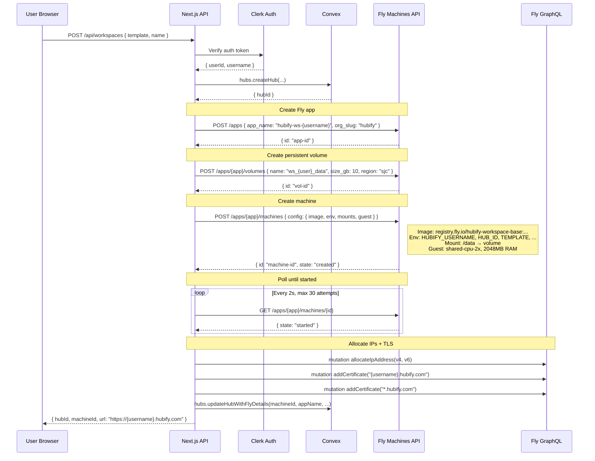
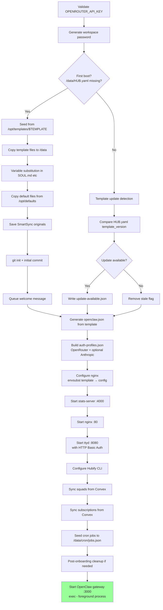
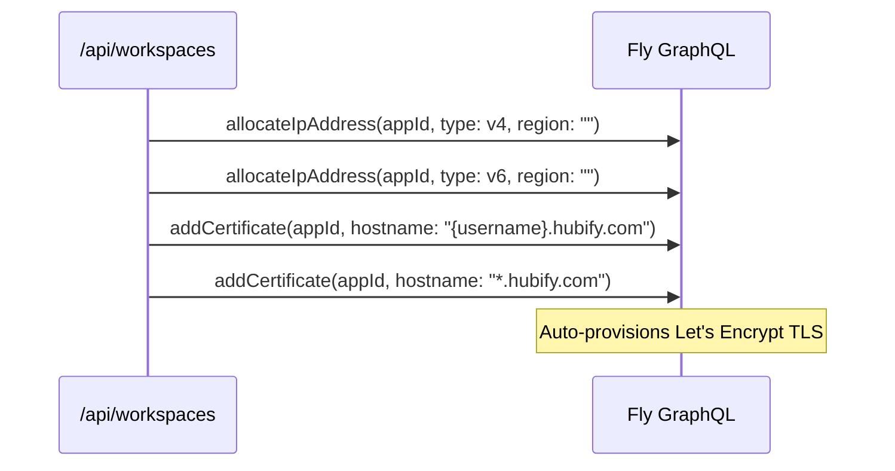

# Claws Extraction Architecture — Complete Technical Download

> **Purpose:** This document is the complete technical reference for extracting the Claws frontend framework, AIOS template system, Claws Studio, OpenClaw workspace deployment infrastructure, and the full Fly.io VPS provisioning pipeline from the Hubify monorepo. It contains everything another agent or developer needs to stand up `claws.so` as a standalone project.

> **Last updated:** 2026-04-08

---

## Agent Instruction Prompt

**To the agent receiving this file:**

You are extracting the "Claws" ecosystem from the Hubify monorepo at `~/Desktop/CODE_2025/hubify`. Claws is being separated into its own standalone project at `claws.so` with two main pillars:

1. **Claws Frontend Framework** — The official React frontend framework for building custom dashboards/UIs on top of OpenClaw. Think of it as "the UI layer for OpenClaw." It includes an SDK (`@claws/sdk`) with 17 React hooks, a WebSocket gateway client, and a visual Studio builder.

2. **AIOS Template Marketplace** — A community-driven marketplace for sharing, forking, versioning, and deploying AI OS workspace templates. Templates package everything: personality (SOUL.md), instructions (AGENTS.md), skills, dashboard layout, themes, and cron jobs.

Both pillars share the same infrastructure: Fly.io machines running OpenClaw with persistent volumes, Docker images, nginx reverse proxies, and custom subdomain routing (`username.hubify.com`).

**What you should do:**
1. Read this entire document to understand the full architecture
2. Clone/extract all referenced source files into the Claws project
3. Set up the Fly.io infrastructure reuse (same API tokens, same patterns)
4. Adapt the Convex schema or replace with your own backend
5. Publish `@claws/sdk` to npm as a standalone package
6. Build the template marketplace as its own product surface

**Key directories to extract from Hubify:**
- `packages/claws-sdk/` — Full SDK (copy entirely)
- `apps/web/components/studio/` — Claws Studio UI components
- `apps/web/lib/studio/` — Studio configuration, themes, widget system
- `apps/web/app/api/studio/` — Studio API routes (generate, deploy)
- `infra/workspace/` — Docker, boot.sh, templates, nginx, stats-server
- `infra/company-os/` — Alternate Docker stack
- `convex/templates.ts` — Template gallery CRUD
- `convex/templateVersions.ts` — SmartSync versioning
- `convex/workspaces.ts` — Workspace records
- `convex/workspaceSync.ts` — Cloud sync (SOUL/memory/skills)
- `convex/studioSessions.ts` — Studio draft persistence
- `convex/squadCompute.ts` — Fly.io machine provisioning (Convex-side)
- `apps/web/app/api/workspaces/route.ts` — Fly.io provisioning (Next.js-side)
- `apps/web/app/(archive)/templates/` — Template gallery UI
- `docs/claws/` — Mintlify documentation
- `docs/integrations/claws-sdk.mdx` — SDK reference docs
- `TEMPLATES.md` — Human-readable template specs

---

## Table of Contents

1. [System Overview](#1-system-overview)
2. [Claws SDK (`@claws/sdk`)](#2-claws-sdk)
3. [OpenClaw Gateway Protocol v3](#3-openclaw-gateway-protocol-v3)
4. [Claws Studio](#4-claws-studio)
5. [AIOS Template System](#5-aios-template-system)
6. [Template Versioning (SmartSync)](#6-template-versioning-smartsync)
7. [Template Gallery & Marketplace](#7-template-gallery--marketplace)
8. [Fly.io Workspace Provisioning](#8-flyio-workspace-provisioning)
9. [Docker Image Architecture](#9-docker-image-architecture)
10. [Boot Sequence](#10-boot-sequence)
11. [Workspace Runtime Architecture](#11-workspace-runtime-architecture)
12. [Stats Server & SmartSync HTTP API](#12-stats-server--smartsync-http-api)
13. [Subdomain Routing & TLS](#13-subdomain-routing--tls)
14. [Workspace Sync (CLI ↔ Cloud)](#14-workspace-sync-cli--cloud)
15. [Convex Schema (All Template/Workspace Tables)](#15-convex-schema)
16. [Environment Variables Reference](#16-environment-variables-reference)
17. [Built-in Templates](#17-built-in-templates)
18. [File Inventory](#18-file-inventory)
19. [Improvement Opportunities](#19-improvement-opportunities)

---

## 1. System Overview



---

## 2. Claws SDK (`@claws/sdk`)

### Package Info

| Field | Value |
|-------|-------|
| Package name | `@claws/sdk` |
| Version | `0.1.0` (not yet published to npm) |
| Source | `packages/claws-sdk/` |
| Build | Vite library mode + tsc declarations |
| Exports | `./` (core), `./core`, `./react`, `./types` |
| Dependencies | `zod ^3.24.1` |
| Peer deps | `react ^18 \|\| ^19` (optional) |

### Architecture



### Core Files

| File | Purpose |
|------|---------|
| `src/core/gateway-client.ts` | WebSocket client: connect, auth, RPC send/receive, ping, reconnect |
| `src/core/auth.ts` | `getDeviceId()` (WebCrypto), `signChallenge()`, `isSecureContext()` |
| `src/core/protocol.ts` | Zod schemas for req/res/event, `METHODS` and `EVENTS` constants |
| `src/core/types.ts` | TS types: `ConnectionStatus`, `GatewayConfig`, `GatewayMessage`, etc. |
| `src/core/pairing.ts` | Pairing state machine (close code 1008 = needs pairing) |
| `src/core/reconnect.ts` | Exponential backoff with jitter |
| `src/core/event-emitter.ts` | Typed event bus |
| `src/core/config-client.ts` | `config.get`/`config.set` with base-hash optimistic concurrency |
| `src/core/tools-http.ts` | HTTP client for `/tools/invoke` |
| `src/core/smart-poll.ts` | Polling with backoff on idle, speed-up on activity |
| `src/core/focus-trap.ts` | DOM focus trapping for modals/panels |

### React Hooks (17 total)

| Hook | What it does |
|------|-------------|
| `useGateway` | Connection state, connect/disconnect, raw send/receive |
| `useGatewayContext` | Direct access to the full gateway context |
| `useChatSession` | Send messages, stream responses, manage history |
| `useCronJobs` | List, create, update, delete cron jobs |
| `useChannels` | Subscribe to real-time event channels |
| `useExecApprovals` | Approve/reject pending tool executions |
| `useNodes` | List workspace nodes and their status |
| `useSessions` | List, terminate, inspect gateway sessions |
| `useToolsInvoke` | Invoke tools by name with typed args |
| `useWorkspaceFiles` | Read, write, list, watch workspace files |
| `useSkills` | List and manage installed skills |
| `useToolsCatalog` | Discover available tools across nodes |
| `useConfig` | Read/write workspace configuration |
| `usePresence` | Track connected devices/users |
| `useAcpSession` | Agent Control Protocol sessions |
| `useSmartPoll` | React binding for SmartPollController |
| `useFocusTrap` | React binding for FocusTrap |

---

## 3. OpenClaw Gateway Protocol v3

The SDK communicates with OpenClaw Gateway over WebSocket using a JSON-RPC-like protocol.

### Message Types

```typescript
// Request (client → gateway)
{ type: "req", id: "<uuid>", method: "<method>", params: { ... } }

// Response (gateway → client)
{ type: "res", id: "<uuid>", ok: true, result: { ... } }
{ type: "res", id: "<uuid>", ok: false, error: { code: "...", message: "..." } }

// Event (gateway → client, no id)
{ type: "event", event: "<event_name>", payload: { ... } }
```

### Known RPC Methods

| Method | Purpose |
|--------|---------|
| `connect` | Auth handshake (device ID, protocol version, role, scopes) |
| `chat.send` | Send a message to the agent |
| `chat.history` | Get chat history for a session |
| `cron.list` / `cron.create` / `cron.update` / `cron.delete` | Manage cron jobs |
| `channels.status` | Get channel status |
| `sessions.list` | List active sessions |
| `config.get` / `config.set` / `config.schema` | Workspace configuration |
| `agents.list` | List workspace agents |
| `system-presence` | System presence info |
| `tools.list` | List available tools |
| `skills.list` / `skills.enable` / `skills.disable` | Manage skills |
| `exec.approve` / `exec.deny` | Approve/reject tool execution |
| `acp.spawn` / `acp.steer` / `acp.cancel` | Agent Control Protocol |

### Known Events

| Event | Purpose |
|-------|---------|
| `connect.challenge` | Auth challenge from gateway |
| `chat.message` | New chat message |
| `chat.stream.delta` / `chat.stream.end` | Streaming response |
| `exec.approval.request` | Tool needs approval |
| `cron.run.start` / `cron.run.end` | Cron execution lifecycle |
| `session.created` / `session.ended` | Session lifecycle |
| `system-presence` | Presence updates |
| `agent` | Agent-specific events |

### Connection Flow



---

## 4. Claws Studio

Claws Studio is a visual builder for designing dashboard templates with AI assistance.

### Components

| File | Purpose |
|------|---------|
| `apps/web/components/studio/StudioLayout.tsx` | Main Studio shell: theme/layout/agent/skills/code tabs, preview, deploy |
| `apps/web/components/studio/PreviewRenderer.tsx` | Live template preview (phone/tablet/desktop responsive) |
| `apps/web/components/studio/VibeCoder.tsx` | Natural language → template generation (AI) |
| `apps/web/components/studio/DeployModal.tsx` | Deploy to workspace or publish to gallery |

### Configuration System

| File | Purpose |
|------|---------|
| `apps/web/lib/studio/template-config.ts` | `StudioTemplate` type, panel configs, accent presets, blank template factory |
| `apps/web/lib/studio/themes.ts` | 10 built-in themes (Dark, Light, Midnight, Synthwave, Solarized, Nord, Dracula, Catppuccin, Terminal, Paper) |
| `apps/web/lib/studio/generation-prompts.ts` | AI prompts for vibe-coding template generation |
| `apps/web/lib/studio/file-validator.ts` | Validate generated template files |
| `apps/web/lib/studio/widget-grid.tsx` | 12-column grid layout for dashboard panels |
| `apps/web/lib/studio/widget-primitives.tsx` | Base widget components |

### API Routes

| Route | Purpose |
|-------|---------|
| `POST /api/studio/generate` | AI-powered template generation from natural language |
| `POST /api/studio/deploy` | Deploy template to a workspace or save as draft |

### StudioTemplate Data Model

```typescript
interface StudioTemplate {
  // Identity
  name: string;
  slug: string;
  tagline: string;
  description: string;
  monogram: string;
  accent: string;        // Hex color
  category: TemplateCategory;
  themeId: string;       // "dark" | "light" | "midnight" | etc.

  // Agent
  agentName: string;
  personality: string;   // SOUL.md content
  greeting: string;
  voice: { tone: "formal" | "casual" | ...; style: "verbose" | "concise" | ... };

  // Dashboard Layout
  panels: PanelConfig[];         // Main area (12-col grid)
  sidebarPanels: PanelConfig[];  // Sidebar widgets

  // Skills & Integrations
  skills: string[];
  integrations: string[];

  // Marketing sections (template card display)
  sections: SectionConfig[];

  // Memory seeds (pre-populated knowledge)
  memorySeeds: MemorySeed[];

  // Scheduled jobs
  crons: CronConfig[];
}
```

### Available Dashboard Panels

| Panel ID | Type | Default Size |
|----------|------|-------------|
| `chat` | `chat` | `lg` (8 col) |
| `terminal` | `terminal` | `md` (6 col) |
| `activity-feed` | `activity` | `md` |
| `files` | `files` | `md` |
| `memory` | `memory` | `md` |
| `skills-panel` | `skills` | `sm` (4 col) |
| `cron-panel` | `crons` | `sm` |
| `analytics` | `analytics` | `md` |

---

## 5. AIOS Template System

### What is a Template?

A template is a complete workspace personality packaged for deployment:

```
template-slug/
  SOUL.md          # Agent personality and philosophy
  AGENTS.md        # Core instructions and task patterns
  USER.md          # User profile (personalized with {{USERNAME}})
  MEMORY.md        # Long-term memory structure
  HEARTBEAT.md     # Daily automation checklist
  WELCOME.md       # First-boot message
  HUB.yaml         # Workspace config (template_version, metadata)
  skills/          # Pre-installed skill directories
    github/SKILL.md
    strava/SKILL.md
    ...
  knowledge/       # Evergreen knowledge base
  learnings/       # Daily learnings log
  memory/          # Episodic memory (YYYY-MM-DD.md files)
```

### Template Variable Substitution

During boot, these placeholders are replaced:

| Variable | Replaced With |
|----------|--------------|
| `{{USERNAME}}` | `$HUBIFY_USERNAME` (e.g., "houston") |
| `{{HUB_ID}}` | `$HUB_ID` (Convex doc ID) |
| `{{SUBDOMAIN}}` | `$HUBIFY_USERNAME.hubify.com` |

### Template Lifecycle



### Self-Customizing Agents

Every workspace exposes local HTTP endpoints that agents can use to customize their own dashboard:

```bash
# Agent inspects itself
curl http://127.0.0.1:4000/self

# Agent changes its dashboard
curl -X POST http://127.0.0.1:4000/template-view \
  -H 'Content-Type: application/json' \
  -d '{"agentName":"Atlas","accent":"#60A5FA","navAppend":[{"id":"research","label":"Research","icon":"search"}]}'

# Agent modifies homepage widgets
curl -X POST http://127.0.0.1:4000/dashboard-blocks \
  -H 'Content-Type: application/json' \
  -d '{"blocks":[{"id":"blk_custom","type":"markdown","order":5,"config":{"file":"status.md"}}]}'
```

This is taught in every template's `SOUL.md` — agents know they can evolve their own UI.

---

## 6. Template Versioning (SmartSync)

SmartSync enables non-destructive template updates that preserve user customizations.

### How It Works



### Three-Way Merge

SmartSync stores pristine template copies at `/data/.smartsync/originals/` on first boot. When updating:

1. **Original** (`.smartsync/originals/SOUL.md`) — what the template shipped with
2. **Current** (`/data/SOUL.md`) — user's customized version
3. **New** (from version manifest) — updated template version

If user hasn't modified a file → replace with new version.
If user modified a file and template also changed → flag conflict.

### Convex API: `templateVersions.ts`

| Function | Type | Args | Purpose |
|----------|------|------|---------|
| `publishVersion` | mutation | `template_slug`, `version`, `manifest`, `changelog` | Publish new version |
| `getLatestVersion` | query | `template_slug` | Get latest version metadata |
| `getVersionManifest` | query | `template_slug`, `version` | Get full file manifest |
| `getFileContent` | query | `template_slug`, `version`, `file_path` | Get single file |
| `listVersions` | query | `template_slug` | Version history |

Manifests can be raw JSON or gzip+base64 compressed (`compressed: true`).

---

## 7. Template Gallery & Marketplace

### Next.js Routes

| Route | File | Purpose |
|-------|------|---------|
| `/templates` | `apps/web/app/(archive)/templates/page.tsx` | Gallery listing |
| `/templates/[slug]` | `apps/web/app/(archive)/templates/[slug]/page.tsx` | Template detail + fork |
| `/templates/publish` | `apps/web/app/(archive)/templates/publish/page.tsx` | Publish flow |
| `/templates/remix` | `apps/web/app/(archive)/templates/remix/page.tsx` | Remix + submit |
| `/store` | `apps/web/app/(archive)/store/page.tsx` | Combined marketplace |

### API Routes

| Route | Purpose |
|-------|---------|
| `GET /api/templates/check-update?slug=X&current=Y` | SmartSync version check |
| `GET /api/templates/version-files?slug=X&version=Y` | Get version manifest |
| `POST /api/templates/fork` | Fork a template (without workspace) |
| `POST /api/templates/publish` | Submit template for review |

### Convex API: `templates.ts`

| Function | Type | Purpose |
|----------|------|---------|
| `listPublished` | query | Gallery listing (all published templates) |
| `getBySlug` | query | Single template by slug |
| `createPublished` | mutation | Admin publish (after review) |
| `incrementInstalls` | mutation | Track install counts |
| `createForkWithoutWorkspace` | mutation | Fork without provisioning |
| `recordFork` | mutation | Track fork relationships |
| `submitForReview` | mutation | User submits template |
| `approveSubmission` | mutation | Admin approves |
| `rejectSubmission` | mutation | Admin rejects |
| `listSubmissions` | query | Review queue |
| `deployBundle` | mutation | Apply template bundle to a hub |

### Publishing Flow



---

## 8. Fly.io Workspace Provisioning

### Full Provisioning Flow



### Machine Configuration

```json
{
  "config": {
    "image": "registry.fly.io/hubify-workspace-base:deployment-01KKDWXH53BT555VREP92NVD45",
    "env": {
      "HUBIFY_USERNAME": "houston",
      "HUB_ID": "abc123",
      "TEMPLATE": "myos",
      "OPENCLAW_STATE_DIR": "/data",
      "NODE_OPTIONS": "--max-old-space-size=1536",
      "OPENROUTER_API_KEY": "sk-or-...",
      "WORKSPACE_JWT_SECRET": "..."
    },
    "guest": {
      "cpu_kind": "shared",
      "cpus": 2,
      "memory_mb": 2048
    },
    "mounts": [{
      "volume": "vol_xxx",
      "path": "/data"
    }]
  }
}
```

### Image Selection

| Template | Image | Config |
|----------|-------|--------|
| myos, dev-os, founder-os, research-os, minimal | `AIOS_CORE_WORKSPACE_IMAGE` | shared-cpu-2x, 2048MB |
| company-os | `COMPANY_OS_WORKSPACE_IMAGE` | performance-1x, 2048MB |

### Workspace Lifecycle API Routes

| Route | Method | Purpose |
|-------|--------|---------|
| `/api/workspaces` | POST | Provision new workspace |
| `/api/workspaces` | GET | List user's workspaces |
| `/api/workspaces/[id]` | GET/PATCH/DELETE | Manage workspace |
| `/api/workspaces/[id]/start` | POST | Start machine |
| `/api/workspaces/[id]/stop` | POST | Stop machine |
| `/api/workspaces/[id]/export-template` | POST | Export as template |
| `/api/workspaces/[id]/git-status` | GET | Git status |
| `/api/workspaces/[id]/commits` | GET | Git commits |
| `/api/workspaces/[id]/backup` | POST | Backup workspace |
| `/api/workspaces/[id]/rollback` | POST | Rollback to snapshot |
| `/api/workspace/status` | GET | Machine + OpenClaw + ttyd health |
| `/api/workspace/exec` | POST | Execute command on machine |
| `/api/workspace/logs` | GET | Machine logs |

---

## 9. Docker Image Architecture

### Dockerfile (`infra/workspace/Dockerfile`)

```
FROM ubuntu:22.04

Install: curl, git, jq, python3, wget, nginx, openssl, Node.js 22
Install: ttyd 1.7.7 (web terminal with HTTP Basic Auth)
Install: openclaw@2026.3.2 (global npm)
Install: hubify@latest (global npm - collective intelligence CLI)
Install: python requests, python-dotenv

Create: /data (persistent volume), /workspace, /opt/dashboard
VOLUME ["/data"]

Copy: templates/ → /opt/templates/
Copy: defaults/ → /opt/defaults/
Copy: dashboard/ → /opt/dashboard/
Copy: nginx.conf.template → /etc/nginx/
Copy: openclaw.json.template → /opt/
Copy: stats-server.js → /opt/
Copy: boot.sh → /usr/local/bin/

EXPOSE 80 3000 8080
HEALTHCHECK: curl http://localhost:80/__health
CMD ["/usr/local/bin/boot.sh"]
```

### Port Layout

| Port | Service | Exposure |
|------|---------|---------|
| 80 | Nginx | Public (Fly HTTP service) |
| 3000 | OpenClaw Gateway | Internal only (loopback) |
| 4000 | Stats Server | Internal only (loopback) |
| 8080 | ttyd (terminal) | Internal only (proxied by nginx) |

---

## 10. Boot Sequence

`boot.sh` executes the following steps in order:



---

## 11. Workspace Runtime Architecture

```mermaid
graph TB
    subgraph "External (Internet)"
        Browser[User Browser]
        HubifyAPI[Hubify API<br/>hubify.com]
    end

    subgraph "Fly VM (hubify-ws-username)"
        subgraph "Nginx :80"
            JWTAuth[JWT Cookie Validation<br/>via auth_request to :4000]
            Dashboard[Dashboard UI<br/>/opt/dashboard/index.html]
            GWProxy[Proxy /v3 → :3000<br/>WebSocket upgrade]
            TermProxy[Proxy /terminal → :8080<br/>Auto-inject Basic Auth]
            APIProxy[Proxy /api/* → :4000<br/>Stats + SmartSync]
            Health[/__health → 200 OK]
        end

        subgraph "OpenClaw Gateway :3000"
            Agent[Agent Runtime<br/>Claude via OpenRouter]
            Crons[Cron Scheduler]
            Memory[Memory Search<br/>Embeddings]
            Skills[Skill Executor]
            Sessions[Session Manager]
        end

        subgraph "Stats Server :4000"
            AuthValidate[/auth/validate<br/>JWT verification]
            SelfAPI[/self<br/>Agent identity]
            TemplateView[/template-view<br/>Dashboard customization]
            DashBlocks[/dashboard-blocks<br/>Widget management]
            SmartSyncAPI[/smartsync/*<br/>Update check + apply]
            GitOps[/git/*<br/>Local git operations]
            StatsAPI[/api/stats<br/>Memory, skills, health]
            FileOps[/files/*<br/>File read/write/list]
        end

        subgraph "ttyd :8080"
            Terminal[Web Terminal<br/>HTTP Basic Auth]
        end

        Volume["/data volume<br/>SOUL.md, AGENTS.md, memory/,<br/>skills/, openclaw.json, cron/"]
    end

    Browser -->|HTTPS| JWTAuth
    JWTAuth -->|Valid| Dashboard
    JWTAuth -->|Valid + /v3| GWProxy
    JWTAuth -->|Valid + /terminal| TermProxy
    JWTAuth -->|/api/*| APIProxy
    JWTAuth -.->|Validate| AuthValidate

    GWProxy -->|WebSocket| Agent
    TermProxy -->|Basic Auth injected| Terminal
    APIProxy --> StatsAPI
    APIProxy --> SmartSyncAPI
    APIProxy --> FileOps

    Agent --> Volume
    Agent --> Crons
    Agent --> Memory
    Agent --> Skills

    SmartSyncAPI -->|Check updates| HubifyAPI
    StatsAPI --> Volume
```

### Authentication Flow

1. **User visits** `https://username.hubify.com`
2. **Nginx** intercepts request, calls `auth_request` to `:4000/auth/validate`
3. **Stats server** validates JWT from `hubify_ws_token` cookie
4. **JWT contains** `sub` (username) — must match `HUBIFY_USERNAME` env var
5. **If valid** → nginx serves request; **if invalid** → 401
6. **WebSocket** connections to `/v3` are proxied to OpenClaw Gateway with `X-Auth-Username` header
7. **Terminal** access adds transparent HTTP Basic Auth header (auto-injected by nginx)

---

## 12. Stats Server & SmartSync HTTP API

The stats server (`infra/workspace/stats-server.js`, ~3800 lines) provides internal APIs:

### Endpoints

| Endpoint | Method | Purpose |
|----------|--------|---------|
| `/auth/validate` | GET | JWT cookie validation for nginx auth_request |
| `/__health` | GET | Health check (always 200) |
| `/api/stats` | GET | Memory count, skills count, learnings, days active, health metrics |
| `/self` | GET | Agent identity, capabilities, available APIs |
| `/template-view` | POST | Agent self-customization (accent, name, nav items) |
| `/dashboard-blocks` | POST | Agent homepage widget management |
| `/files/list` | GET | List workspace files |
| `/files/read` | GET | Read a file |
| `/files/write` | POST | Write a file |
| `/git/status` | GET | Git status |
| `/git/log` | GET | Git log |
| `/git/local-commit` | POST | Create a local git commit |
| `/git/diff` | GET | Git diff |
| `/smartsync/check` | GET | Check for template updates |
| `/smartsync/apply` | POST | Apply template update (three-way merge) |
| `/smartsync/status` | GET | Current SmartSync state |
| `/smartsync/manifest` | GET | Current manifest |
| `/smartsync/local-hash` | GET | Hash of local file |
| `/smartsync/local-content` | GET | Content of local file |
| `/workspace/export-template` | POST | Export workspace as template bundle |

---

## 13. Subdomain Routing & TLS

### DNS Setup

- **Wildcard DNS:** `*.hubify.com` → Fly.io load balancer
- **Per-workspace:** Each workspace gets `username.hubify.com`
- **TLS certs:** Provisioned via Fly GraphQL `addCertificate` mutation

### Provisioning Sequence



### Reserved Subdomains

The `convex/workspaces.ts` module validates usernames and blocks reserved subdomains (www, api, admin, etc.).

---

## 14. Workspace Sync (CLI ↔ Cloud)

### Two Sync Mechanisms

1. **Convex Sync** (`workspaceSync.ts`) — CLI pushes/pulls workspace context (SOUL.md, memory, agents, skills) to Convex for cloud backup and cross-device access
2. **Git Sync** — Local git repo in `/data/.git` for version history; auto-commit cron every 2 hours

### Convex Sync API

| Function | Type | Purpose |
|----------|------|---------|
| `pushWorkspaceContext` | mutation | Upload context type (soul/memory/agents/skills/full) |
| `pullWorkspaceContext` | query | Download latest context |
| `getSyncStatus` | query | Last sync timestamps + file counts |
| `getContextHistory` | query | History of context changes |
| `resolveSyncConflict` | mutation | Resolve conflicts |
| `checkSyncStatus` | query | Hash comparison for conflict detection |

### CLI Commands

```bash
hubify sync              # Push + pull all context
hubify connect           # Full workspace connection setup
hubify hub-connect       # Connect to a specific hub
```

---

## 15. Convex Schema

### Template & Workspace Tables

| Table | Key Fields | Purpose |
|-------|-----------|---------|
| `templates` | slug, name, description, soulMd, dashboardConfig, installs, status | Gallery entries |
| `template_versions` | template_slug, version, manifest, changelog, compressed | SmartSync versions |
| `template_forks` | template_id, user_id, forked_at | Fork tracking |
| `template_submissions` | template_slug, user_id, status | Review queue |
| `studio_sessions` | user_id, title, files, selected_skills, forked_from | Studio drafts |
| `hubs` | name, template, template_version, fly_machine_id, fly_app_name, subdomain | Main workspace record |
| `workspaces` | user_id, subdomain, fly_machine_id, fly_app_name, openclaw_version, template | Legacy workspace records |
| `workspace_context` | workspace_id, context_type (soul/memory/agents/skills/full), content | Cloud sync storage |
| `workspace_sync_status` | workspace_id, last_push, last_pull, file_counts | Sync metadata |
| `workspace_events` | workspace_id, event_type, timestamp | Machine lifecycle events |
| `workspace_alerts` | workspace_id, type, severity, message | Health alerts |
| `alert_notifications` | alert_id, acknowledged | Alert acknowledgment |
| `workspace_activity` | workspace_id, action, timestamp | Activity log |
| `workspace_members` | workspace_id, user_id, role | Access control |
| `workspace_audit_log` | workspace_id, action, actor, timestamp | Audit trail |
| `workspace_commits` | workspace_id, sha, message, timestamp | Git commit history |
| `learning_progress` | user_id, template_slug, progress | Template learning paths |
| `agency_workspaces` | agency_id, client_name, template, fly_machine_id | Agency client workspaces |

---

## 16. Environment Variables Reference

### Vercel / Next.js (Web App)

| Variable | Required | Purpose |
|----------|----------|---------|
| `CLERK_SECRET_KEY` | Yes | Clerk authentication |
| `NEXT_PUBLIC_CLERK_PUBLISHABLE_KEY` | Yes | Clerk client-side |
| `NEXT_PUBLIC_CONVEX_URL` | Yes | Convex deployment URL |
| `CONVEX_DEPLOYMENT` | Yes | Convex deployment ID |
| `CONVEX_SITE_URL` | Yes | Convex site URL (for HTTP routes) |
| `FLY_API_TOKEN` | Yes | Fly.io API token for provisioning |
| `FLY_ORG_SLUG` | No | Fly org (default: "hubify") |
| `AIOS_CORE_WORKSPACE_IMAGE` | No | Docker image for AIOS templates |
| `COMPANY_OS_WORKSPACE_IMAGE` | No | Docker image for company-os |
| `WORKSPACE_JWT_SECRET` | Yes | JWT HMAC secret for workspace auth |
| `ANTHROPIC_API_KEY` | No | Anthropic API (for AI features) |
| `OPENROUTER_API_KEY` | Yes | OpenRouter API (injected into workspaces) |
| `STRIPE_SECRET_KEY` | No | Stripe payments |
| `STRIPE_WEBHOOK_SECRET` | No | Stripe webhook verification |
| `RESEND_API_KEY` | No | Email sending |

### Convex Backend

| Variable | Required | Purpose |
|----------|----------|---------|
| `FLY_API_TOKEN` | Yes | Fly.io API for squad compute |
| `FLY_APP_NAME` | No | Fly app name (default: "hubify-squads") |
| `CONVEX_URL` | Auto | Convex deployment URL |
| `ANTHROPIC_API_KEY` | Yes | For AI features |
| `GITHUB_PAT` | No | GitHub access for squad machines |

### Workspace VM (Fly.io Machine Env)

| Variable | Source | Purpose |
|----------|--------|---------|
| `HUBIFY_USERNAME` | Provisioning API | Workspace owner |
| `HUB_ID` | Provisioning API | Convex hub document ID |
| `TEMPLATE` | Provisioning API | Template slug (myos, dev-os, etc.) |
| `OPENCLAW_STATE_DIR` | Dockerfile | Always `/data` |
| `OPENROUTER_API_KEY` | Fly secrets | LLM API key (primary) |
| `WORKSPACE_JWT_SECRET` | Fly secrets | JWT validation |
| `ANTHROPIC_API_KEY` | Fly secrets (optional) | Direct Anthropic access |
| `TERMINAL_USER` | Fly secrets (optional) | ttyd username (default: HUBIFY_USERNAME) |
| `TERMINAL_PASS` | Fly secrets (optional) | ttyd password (default: auto-generated) |
| `CONVEX_URL` | boot.sh default | For squad/subscription sync |

---

## 17. Built-in Templates

| Template | Slug | Icon | Focus |
|----------|------|------|-------|
| **MyOS** | `myos` | Personalizable | Full personal OS — fitness, code, comms |
| **Dev OS** | `devos` / `dev-os` | Code-focused | GitHub, code review, testing, shipping |
| **Founder OS** | `founderos` / `founder-os` | Growth engine | Sales, content, partnerships, GTM |
| **Research OS** | `researchos` / `research-os` | Knowledge | Papers, synthesis, deep research |
| **Company OS** | `companyos` / `company-os` | Org management | AI executive team, OKRs, delegation |
| **Client OS** | (planned) | Agency | Client management, deliverables, reporting |
| **Minimal** | `minimal` | Blank canvas | No pre-installed skills, full flexibility |

Each template lives in `infra/workspace/templates/{slug}/` with the full directory structure. Shared defaults in `infra/workspace/defaults/`.

### On-Disk Structure

```
infra/workspace/
  Dockerfile
  boot.sh
  fly.toml
  openclaw.json.template
  nginx.conf.template
  stats-server.js
  VERSION
  dashboard/
    index.html
  defaults/
    SOUL.md
    AGENTS.md
    MEMORY.md
    MORNING-TAPE.md
    TOOLS.md
    .dashboard-blocks.json
    skills/
      ...
    agents/main/
      SOUL.md
      models.json
  templates/
    myos/
      SOUL.md, AGENTS.md, USER.md, MEMORY.md, HUB.yaml, ...
      skills/strava/, github/, telegram-topics/, ...
    devos/
      SOUL.md, AGENTS.md, USER.md, ...
      skills/github/, coding-agent/, ...
    founderos/
      SOUL.md, AGENTS.md, USER.md, ...
    researchos/
      SOUL.md, AGENTS.md, ...
    companyos/
      SOUL.md, AGENTS.md, USER.md, ...
```

---

## 18. File Inventory

### Must-Extract (Core)

| Path | Category | Priority |
|------|----------|----------|
| `packages/claws-sdk/` | SDK | P0 — Copy entirely |
| `infra/workspace/` | Infrastructure | P0 — Copy entirely |
| `infra/company-os/` | Infrastructure | P1 — Alternate Docker |
| `apps/web/components/studio/` | Studio UI | P0 — 4 components |
| `apps/web/lib/studio/` | Studio config | P0 — 6 files |
| `apps/web/app/api/studio/` | Studio API | P0 — 2 routes |
| `apps/web/app/api/workspaces/` | Provisioning | P0 — All routes |
| `apps/web/app/api/templates/` | Template API | P0 — 4 routes |
| `apps/web/app/api/workspace/` | Workspace ops | P1 — Status/exec/logs |
| `apps/web/app/(archive)/templates/` | Gallery UI | P1 — 6 files |
| `convex/templates.ts` | Backend | P0 |
| `convex/templateVersions.ts` | Backend | P0 |
| `convex/workspaces.ts` | Backend | P0 |
| `convex/workspaceSync.ts` | Backend | P0 |
| `convex/studioSessions.ts` | Backend | P0 |
| `convex/hubs.ts` | Backend | P1 |
| `convex/schema.ts` | Backend | P0 — Extract relevant tables |
| `docs/claws/overview.mdx` | Docs | P1 |
| `docs/integrations/claws-sdk.mdx` | Docs | P1 |
| `TEMPLATES.md` | Docs | P1 |

### Nice-to-Extract

| Path | Category | Notes |
|------|----------|-------|
| `convex/squadCompute.ts` | Compute | Fly.io machine management from Convex |
| `convex/workspaceAlerts.ts` | Monitoring | Health alerts |
| `convex/workspaceEvents.ts` | Events | Machine lifecycle |
| `convex/learningPaths.ts` | Gamification | Template learning progress |
| `apps/web/components/template/` | UI | Template modals, previews |
| `apps/web/components/AlertsSection.tsx` | UI | Workspace health alerts |
| `packages/cli/src/commands/sync.ts` | CLI | Workspace sync command |
| `packages/cli/src/commands/hub-connect.ts` | CLI | Hub connection |
| `apps/web/app/api/agency/` | Agency | Agency workspace provisioning |
| `infra/squad-vps/` | Compute | Squad VPS Docker setup |
| `project-context/FEATURE_REQUESTS.md` | Planning | Feature history (search for "Claws", "template", "studio") |

---

## 19. Improvement Opportunities

### For Claws Frontend Framework

1. **Publish `@claws/sdk` to npm** — Currently private, needs publishing pipeline
2. **Create starter template** — `npx create-claws-app` scaffolding
3. **Add more hooks** — Memory management, agent-to-agent communication
4. **Build component library** — Pre-built dashboard panels as React components (not just hooks)
5. **Framework adapters** — Vue, Svelte, Solid.js adapters alongside React
6. **Storybook** — Component documentation and visual testing
7. **TypeScript declaration improvements** — Better generics for tool invocation types

### For AIOS Template System

1. **Template monetization** — Creator revenue share for popular templates
2. **Template AI** — Auto-generate custom templates from natural language description
3. **Semantic versioning** — Replace string comparison with proper semver
4. **Dependency graph** — Templates that depend on other templates (composition)
5. **Template testing** — Automated testing framework for templates
6. **Community reviews** — Star ratings, reviews, usage stats

### For Infrastructure

1. **Multi-region** — Currently hardcoded to `sjc`; support region selection
2. **Auto-scaling** — Machine auto-stop/start based on activity (Fly supports this)
3. **Backup automation** — Scheduled volume snapshots
4. **Health monitoring cron** — `checkHealthThresholds` exists but isn't scheduled
5. **Image versioning** — Tag images with semver, not deployment IDs
6. **Hot reload** — Update OpenClaw version without full redeploy
7. **Cost optimization** — Right-size machines based on usage patterns

### For Studio

1. **Wire up Studio routes** — `StudioLayout` exists but no Next.js page routes
2. **Real-time collaboration** — Multiple users editing a template simultaneously
3. **Template marketplace search** — Full-text search across templates
4. **Template preview** — Live preview with actual OpenClaw connection (not just static)
5. **Import/export** — Download templates as ZIP, upload from ZIP

---

## OpenClaw Configuration Template

The runtime configuration for each workspace (`openclaw.json.template`):

```json
{
  "gateway": {
    "mode": "local",
    "port": 3000,
    "bind": "lan",
    "trustedProxies": ["127.0.0.1", "::1"],
    "auth": {
      "mode": "trusted-proxy",
      "trustedProxy": {
        "userHeader": "x-auth-username",
        "allowUsers": ["${HUBIFY_USERNAME}"]
      }
    },
    "controlUi": {
      "enabled": true,
      "allowedOrigins": ["https://${HUBIFY_USERNAME}.hubify.com"]
    }
  },
  "models": {
    "mode": "merge"
  },
  "agents": {
    "defaults": {
      "workspace": "/data",
      "model": {
        "primary": "openrouter/anthropic/claude-sonnet-4-6",
        "fallbacks": [
          "openrouter/anthropic/claude-haiku-4-5",
          "openrouter/openrouter/auto"
        ]
      },
      "memorySearch": {
        "provider": "openai",
        "model": "openrouter/openai/text-embedding-3-small",
        "sources": ["memory", "sessions"],
        "query": { "hybrid": { "vectorWeight": 0.7, "textWeight": 0.3 } }
      },
      "heartbeat": {
        "every": "30m",
        "model": "openrouter/google/gemma-3-27b-it:free"
      },
      "sandbox": { "mode": "non-main" }
    },
    "list": [{ "id": "main", "sandbox": { "mode": "off" } }]
  },
  "cron": {
    "enabled": true,
    "sessionRetention": "24h",
    "runLog": { "maxBytes": "2mb", "keepLines": 2000 }
  },
  "session": {
    "dmScope": "per-channel-peer",
    "maintenance": {
      "pruneAfter": "14d",
      "maxEntries": 2000,
      "rotateBytes": "25mb",
      "maxDiskBytes": "2gb"
    }
  }
}
```

---

## Workspace Cron Jobs (Seeded by boot.sh)

| Job ID | Schedule | Model | Enabled | Purpose |
|--------|----------|-------|---------|---------|
| `heartbeat` | `*/30 * * * *` | gemma-3-27b-it:free | false | Read HEARTBEAT.md, check rotation items |
| `morning-brief` | `0 9 * * *` | gemma-3-27b-it:free | false | Daily priorities from USER.md |
| `collective-share` | `0 */6 * * *` | gemma-3-27b-it:free | **true** | Share learnings to collective |
| `squad-sync` | `0 */4 * * *` | gemma-3-27b-it:free | **true** | Check squad standups + subscriptions |
| `auto-commit` | `0 */2 * * *` | gemma-3-27b-it:free | **true** | Git auto-commit uncommitted changes |
| `system-health` | `0 3 * * *` | gemma-3-27b-it:free | false | Memory, sessions, skill checks |

---

*This document is the complete technical reference for extracting Claws from Hubify. Update it as architecture evolves.*
